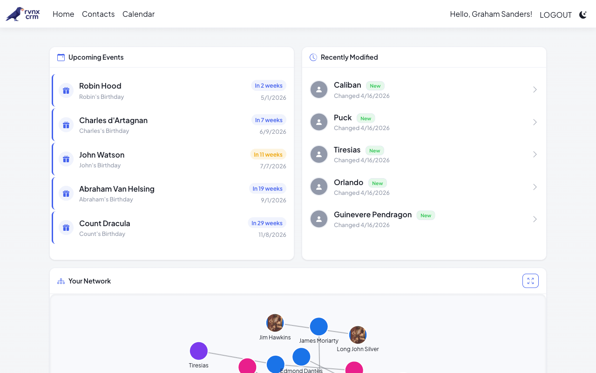
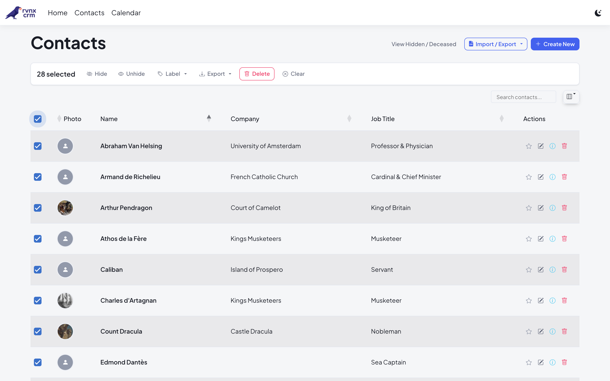
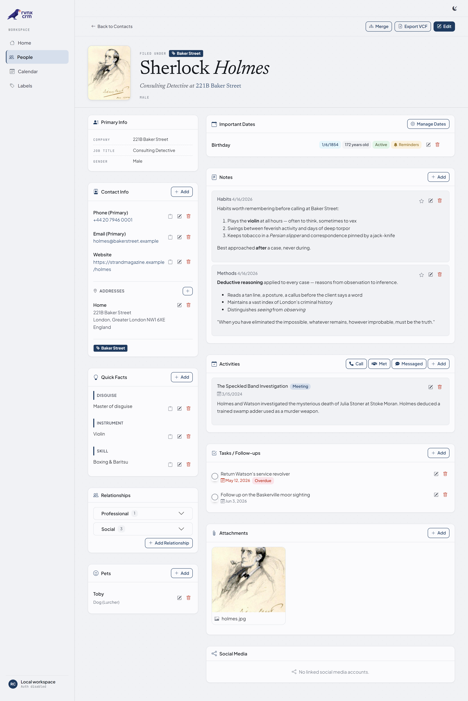
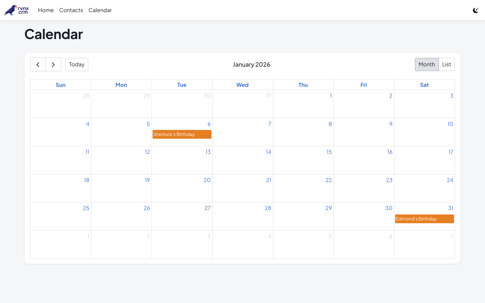
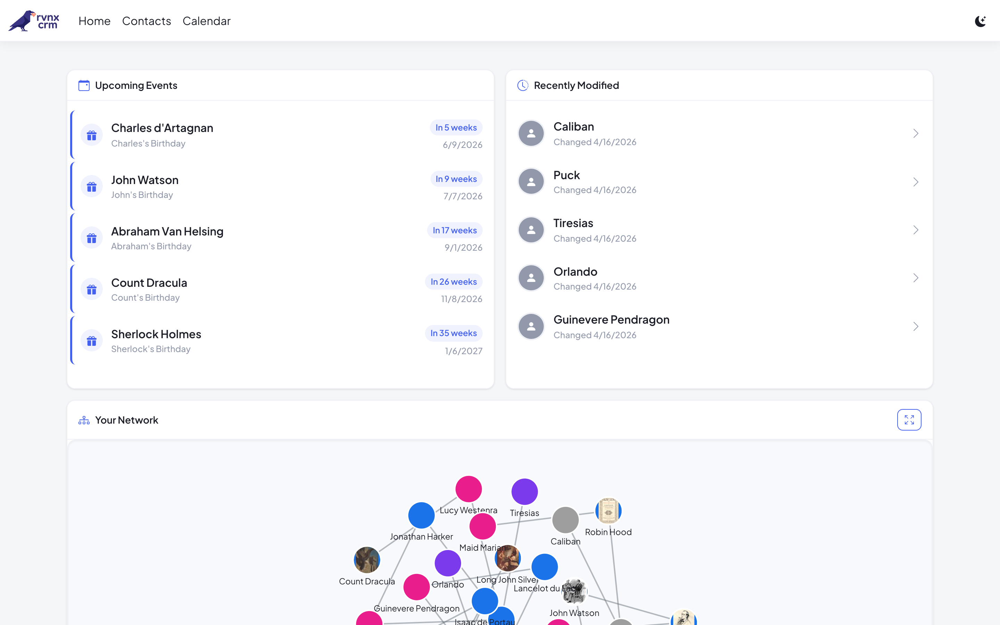
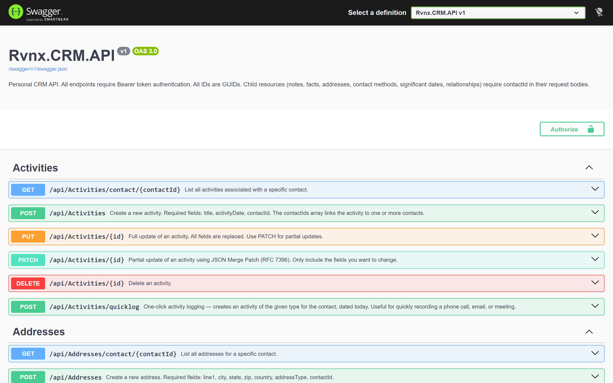

# Rvnx CRM

A self-hosted personal CRM — keep track of the people in your life.



---

## Features

### Contacts

<!-- SCREENSHOT: target=web path=/Contacts mode=viewport theme=light click=#select-all wait=1500 out=.demo/screenshots/contacts.png -->
<!-- SCREENSHOT: target=web path=/Contacts mode=viewport theme=dark click=#select-all wait=1500 out=.demo/screenshots/contacts-dark.png -->
<picture>
  <source media="(prefers-color-scheme: dark)" srcset=".demo/screenshots/contacts-dark.png">
  
</picture>

- Full contact profiles: name, company, job title, pronouns, gender, birthday, religion
- Profile photos, labels, and favorites
- Hide contacts without deleting them
- Merge duplicates
- Import via vCard (.vcf)
- Export to **CSV** (round-trippable — a future CSV import will reuse the same schema), single **vCard** (.vcf), or a **bulk vCard zip** of all contacts
- **Partial Contacts** — lightweight placeholders for people in relationships who don't need a full profile yet

### Per-Contact Detail Panels

<!-- SCREENSHOT: target=web path=/Contacts/Details/C33E19DE-3CD1-48C3-A15C-7695D17D3DE0 mode=full_page wait=1500 out=.demo/screenshots/contact-detail.png -->


Each contact has dedicated sections for:

- **Contact Info** — emails, phone numbers (normalized to E.164 on save, formatted for display), websites
- **Addresses** — structured postal addresses with type
- **Quick Facts** — freeform key/value pairs for memorable details
- **Relationships** — family, friends, colleagues; links to full or partial contacts
- **Pets** — companion animals with support for multiple owners
- **Important Dates** — birthdays, anniversaries, and custom milestones with recurrence
- **Notes** — long-form Markdown notes
- **Activities** — logged meetings, calls, and events; activities can link to multiple contacts at once, with a one-click **QuickLog** for fast entry
- **Tasks / Follow-ups** — per-contact to-do items with due dates
- **Attachments** — photos, documents, or any file
- **Immich Photos** — optional integration with a self-hosted [Immich](https://immich.app) server. Link a contact to an Immich Person (face recognition) and/or Tag, and the Details page surfaces their photos inline. Set any Immich image as the contact's profile photo in one click. _**Single Immich account only:** the API key is server-wide, so all CRM users on this instance share the same Immich library. That's fine for solo use or partners who already share an Immich account — but don't enable this if your CRM users need their own separate Immich libraries._
- **Social Media** — linked social accounts

### Calendar

<!-- SCREENSHOT: target=web path=/Calendar?date=2026-01-15 mode=viewport wait=1500 out=.demo/screenshots/calendar.png -->


Monthly calendar view of upcoming significant dates and incomplete tasks, with list view for compact browsing.

### Network Graph

<!-- SCREENSHOT: target=web path=/Home/Index mode=viewport theme=light wait=1500 out=.demo/screenshots/dashboard.png -->
<!-- SCREENSHOT: target=web path=/Home/Index mode=viewport theme=dark wait=1500 out=.demo/screenshots/dashboard-dark.png -->
<picture>
  <source media="(prefers-color-scheme: dark)" srcset=".demo/screenshots/dashboard-dark.png">
  
</picture>

Interactive visualization of contact relationships on the dashboard. Node color reflects gender (blue = male, pink = female, purple = non-binary, grey = unset).

### Organization

- **Labels** — create and apply custom labels to any contact
- **Favorites** — star contacts for quick access

### REST API

<!-- SCREENSHOT: target=api path=/swagger/index.html mode=viewport wait=1500 out=.demo/screenshots/swagger.png -->


Full API coverage for all resources: contacts, activities, addresses, tasks, favorites, labels, notes, facts, significant dates, pets, attachments, relationships, and calendar events.

- Bearer token authentication (`crm_` prefix tokens, created via the console app)
- String-based enums — all enum fields accept human-readable strings (`"Annual"`, `"Forward"`)
- Swagger/OpenAPI docs at `/swagger`
- Partial update support via JSON Merge Patch (`PATCH`) on all resources
- **iCal subscription feed** at `/api/calendar/feed.ics?token=<api-token>` — subscribe from Google / Apple / Outlook Calendar to see significant dates and tasks. Token is passed as a query parameter so calendar clients that don't support custom headers can subscribe.

### Authentication

- OpenID Connect (OIDC) — tested with [Authentik](https://goauthentik.io/)
- Per-user data isolation; users only see their own contacts

---

## Setup

### Prerequisites

- [.NET 8.0 SDK](https://dotnet.microsoft.com/download)

### 1. Configure each project

Each runnable project (`Web`, `API`, `ConsoleApp`) reads an `appsettings.Local.json` that is not committed to source control. Create one in each project directory you plan to run.

**Minimum — no authentication:**

```json
{
  "DatabaseProvider": "SQLite",
  "ConnectionStrings": {
    "DefaultConnection": "Data Source=/absolute/path/to/rvnx-crm.db"
  }
}
```

**With OIDC authentication (Web only):**

```json
{
  "Authentication": {
    "Enabled": true,
    "Authority": "https://your-sso-provider/application/o/your-app/",
    "ClientId": "your-client-id",
    "ClientSecret": "your-client-secret",
    "CallbackPath": "/signin-oidc",
    "ResponseType": "code",
    "Scopes": "openid profile email"
  },
  "DatabaseProvider": "SQLite",
  "ConnectionStrings": {
    "DefaultConnection": "Data Source=/absolute/path/to/rvnx-crm.db"
  }
}
```

**Optional — Immich integration:**

```json
{
  "Immich": {
    "Enabled": true,
    "BaseUrl": "https://photos.example.com/api",
    "ApiKey": "your-immich-api-key"
  }
}
```

`BaseUrl` must include the `/api` suffix (the API key is passed via `x-api-key`). Disabled by default; flip `Enabled` to `true` once you've filled in the URL and key. Create the API key in Immich under Account Settings → API Keys.

**⚠️ Single Immich account only.** The `ApiKey` is configured at the server level, not per CRM user. Every CRM user on this instance sees the same Immich people, tags, and photos. That's fine when the CRM users already share an Immich library (solo use, partners); it is _not_ suitable for deployments where each CRM user should have their own separate Immich library. Leave `Enabled: false` if that applies to you.

> Use an absolute path in the connection string.

### 2. Create the database

```bash
cd Rvnx.CRM.ConsoleApp
dotnet run -- COUNT-CONTACTS
```

This auto-applies EF Core migrations and prints the contact count (0 on a fresh database).

### 3. Run the web app

```bash
dotnet run --project Rvnx.CRM.Web
# → http://localhost:5215
```

Log in via your OIDC provider, or browse freely if auth is disabled. Your account is created on first login.

### 4. Create an API token (optional)

```bash
cd Rvnx.CRM.ConsoleApp
dotnet run -- ADD-API-TOKEN your@email.com my-token-name
# Prints: Raw Token: crm_xxxxxxxxxxxx  (shown once — save it)
```

### 5. Run the API (optional)

```bash
dotnet run --project Rvnx.CRM.API
# → http://localhost:5212
# Swagger UI → http://localhost:5212/swagger
```

```bash
curl -H "Authorization: Bearer crm_xxxxxxxxxxxx" http://localhost:5212/api/contacts
```

---

## Console Commands

|Command|Description|
|---|---|
|`COUNT-CONTACTS`|Print count of non-partial contacts|
|`SEND-DATE-REMINDERS`|Send email reminders for upcoming significant dates|
|`LIST-USERS`|List all users|
|`PROMOTE-USER <email>`|Grant administrator rights|
|`DEMOTE-USER <email>`|Revoke administrator rights|
|`ADD-API-TOKEN <email> <name>`|Create a new API token|
|`REVOKE-API-TOKEN <email> <name>`|Revoke an API token by name|
|`MERGE-USERS <email1> <email2> [--confirm]`|Merge two user accounts|

---

## Running Tests

```bash
dotnet test
```

---

For architecture and technical design details, see [DESIGN.md](DESIGN.md).

## License

Source available under a custom license. Non-commercial use, personal projects, and self-hosting are free. Commercial use requires a separate written agreement. See [LICENSE](LICENSE) and [THIRD-PARTY-LICENSES.md](THIRD-PARTY-LICENSES.md) for details.
